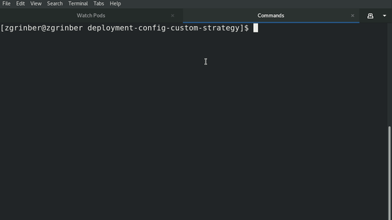

# deployment-config-custom-strategy

## Objectives

- To show how to create a Custom Strategy with your deployment logic using Openshift' DeploymentConfig.
- To Show deployment Strategies modes using deploymentConfig that has no downtime at all, and favouring new version replicas all the time over the older version while the deployment is not finished.


## Demos

Create new project:
```shell
oc new-project dc-test-custom-strategy
```

### Custom Strategy Using DeploymentConfig.


1.  Need to create RBAC Permissions for the deployer `ServiceAccount` in the project, so it will be able to get/list DeploymentConfig Resource

Role.yaml
```yaml
apiVersion: rbac.authorization.k8s.io/v1
kind: Role
metadata:
  name: get-deployment-config
rules:
  - apiGroups:
      - apps.openshift.io
    resources:
      - deploymentconfigs
    verbs:
      - get
      - list
      - watch
  - apiGroups:
      - "apps.openshift.io"
    resources:
      - deploymentconfigs/scale
    verbs:
      - get
      - update
```

RoleBinding.yaml:
```yaml
apiVersion: rbac.authorization.k8s.io/v1
kind: RoleBinding
metadata:
  name: enrich-deployer-with-get-dc
roleRef:
  apiGroup: rbac.authorization.k8s.io
  kind: Role
  name: get-deployment-config
subjects:
  - kind: ServiceAccount
    name: deployer
    namespace: dc-test-custom-strategy
```

2. Create DeploymentConfig resource with Custom Strategy:
```yaml
apiVersion: apps.openshift.io/v1
kind: DeploymentConfig
metadata:
  name: dc-custom-strategy-test
spec:
  replicas: 4
  selector:
    deployment-config.name: dc-custom-strategy-test
  strategy:
    type: Recreate
    customParams:
      image: openshift/origin-deployer
      command:
      - /usr/bin/bash
      - -c
      - |
        set -e
        export DC_NAME=$(oc get rc ${OPENSHIFT_DEPLOYMENT_NAME} -o=jsonpath="{.metadata.ownerReferences[0].name}" -n ${OPENSHIFT_DEPLOYMENT_NAMESPACE})
        export REPLICAS=$(oc get deploymentconfig ${DC_NAME} -o jsonpath="{.spec.replicas}" -n ${OPENSHIFT_DEPLOYMENT_NAMESPACE})
        echo "About to scale down to 1"
        oc scale rc/${OPENSHIFT_DEPLOYMENT_NAME} --replicas=1 -n ${OPENSHIFT_DEPLOYMENT_NAMESPACE}
        readyReplicas=$(oc get rc ${OPENSHIFT_DEPLOYMENT_NAME} -o=jsonpath="{.status.readyReplicas}")
        echo "Waiting for 1 replica of new version to be ready"
        while [ "$readyReplicas" == "" ] 
        do
          sleep 1
          readyReplicas=$(oc get rc ${OPENSHIFT_DEPLOYMENT_NAME} -n ${OPENSHIFT_DEPLOYMENT_NAMESPACE} -o=jsonpath="{.status.readyReplicas}")
        done
        echo "New version Replica is Ready"
        echo "Continuing with the replacing all older version replicas with new ones at once!" 
        openshift-deploy --deployment ${OPENSHIFT_DEPLOYMENT_NAME} --until 100%

  template:
    metadata:
      labels:
        deployment-config.name: dc-custom-strategy-test
        app-version: v1
    spec:
      containers:
      - image: busybox
        name: default-container
        imagePullPolicy: IfNotPresent
        command:
        - /bin/sh
        - -c
        - "sleep 15 ; echo \"service is ready\" ; echo 1  >> /tmp/readiness.out ; sleep infinity"
        readinessProbe:
          initialDelaySeconds: 5
          periodSeconds: 5
          failureThreshold: 4
          exec:
            command:
            - cat
            - /tmp/readiness.out

  test: false
  triggers:
    - type: ConfigChange

```

3. Now apply using a kustomization overlay all the above to the new project:
```shell
oc kustomize .  | oc apply -f -
```

4. Watch the deployment process in live
```shell
watch --interval 1 oc get pods  --sort-by '{.metadata.name}'
```

5. When all replicas are ready, change .spec.template.metadata.labels.app-version (for example , to value of v2) in deploymentconfig manifest file , and apply again deploymentconfig to cluster:
```shell
oc apply -f deployment-config.yaml
```
Or directly with json patch 
```shell
oc patch dc dc-custom-strategy-test  --type='json' -p='[{"op": "replace", "path": "/spec/template/metadata/labels/app-version", "value": "v2" }]'
```

6. Watch the deployment process in live, take a look how no downtime of service is achieved.
```shell
watch --interval 1 oc get pods  --sort-by '{.metadata.name}
```

7. When deployment is over, delete everything:
```shell
kustomize build . | oc delete -f -
```

Demo:



### Rolling Update Strategy With Specific RollingUpdate Params

There is a formula that should do the work in general , if you consider the number of replicas to be n , then you define it as follows:

**for n=1 , it's trivial and you don't need to set any special parameters, just use rolling update strategy, which is the default.**

**for n > 1 , you should define the following:**

- spec.strategy.rollingParams.maxSurge = 1

- spec.strategy.rollingParams.maxUnavailable = n-1 

1. For example, for n=4 , Need to deploy the following deployment config: 

```yaml
apiVersion: apps.openshift.io/v1
kind: DeploymentConfig
metadata:
  name: dc-rolling-strategy-test
spec:
  replicas: 4
  selector:
    deployment-config.name: dc-custom-strategy-test
  strategy:
    type: Rolling
    customParams:
      image: openshift/origin-deployer
    rollingParams:
      maxSurge: 1
      maxUnavailable: 3
  template:
    metadata:
      labels:
        deployment-config.name: dc-custom-strategy-test
        app-version: v1
    spec:
      containers:
      - image: busybox
        name: default-container
        imagePullPolicy: IfNotPresent
        command:
        - /bin/sh
        - -c
        - "sleep 15 ; echo \"service is ready\" ; echo 1  >> /tmp/readiness.out ; sleep infinity"
        readinessProbe:
          initialDelaySeconds: 5
          periodSeconds: 5
          failureThreshold: 4
          exec:
            command:
            - cat
            - /tmp/readiness.out

  test: false
  triggers:
    - type: ConfigChange
```
```shell
oc apply -f using-rolling-update-parameters/deployment-config.yaml
```

2. Watch the deployment process in live
```shell
watch --interval 1 oc get pods  --sort-by '{.metadata.name}'
```


3. Once all replicas are up and ready, "upgrade" to next version by using a json patch:
```shell
oc patch dc dc-rolling-strategy-test  --type='json' -p='[{"op": "replace", "path": "/spec/template/metadata/labels/app-version", "value": "v2" }]'
```

4. Watch the deployment process in live, take a look how no downtime of service is achieved.
```shell
watch --interval 1 oc get pods  --sort-by '{.metadata.name}
```

5. When all pods of new revision is up and ready, you can delete it to release resources:
```shell
oc delete -f using-rolling-update-parameters/deployment-config.yaml
```